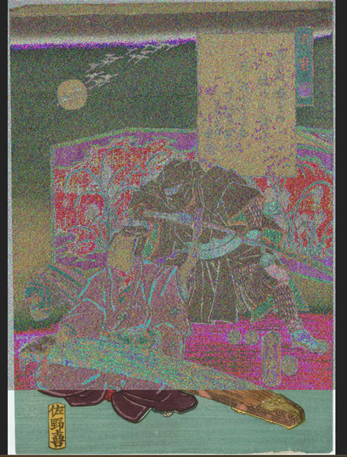
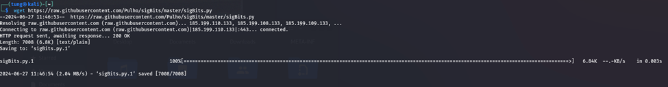
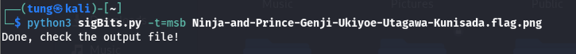
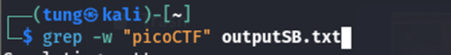
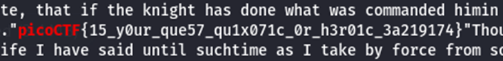

# Write-up challenge MSB trong picoCTF 
***
# Đề bài 
* This image passes LSB statistical analysis, but we can't help but think there must be something to the visual artifacts present in this image...
Download the image here

***

### Tiếp cận và giải quyết
* Sau khi download file của challenge và mở ra ta được 1 hình ảnh bị nhiễu có đuôi png như này **Ninja-and-Prince-Genji-Ukiyoe-Utagawa-Kunisada.flag.png** :

* Sau khi đọc description ta thấy ảnh này có liên quan đến LSB statistical analysis và tên challenge cũng là MSB nên ta lên google tìm kiếm và thấy 1 chương trình có sẵn của python là sigBits.py hỗ trợ phân tích cả dữ liệu của LSB và MSB 

* Sau khi tải xong chương trình ta chạy chương trình theo lệnh như sau: 

* Nhập lệnh `ls` ta thấy 1 file có tên outputSB.txt nghi ở trong này có flag ta dùng lệnh `grep` để tìm kiến cụm **picoCTF** trong file :

* Sau khi dùng `grep` lướt 1 hồi lâu ta tìm được flag :

Flag: ***picoCTF{15_y0ur_que57_qu1x071c_0r_h3r01c_3a219174}***
